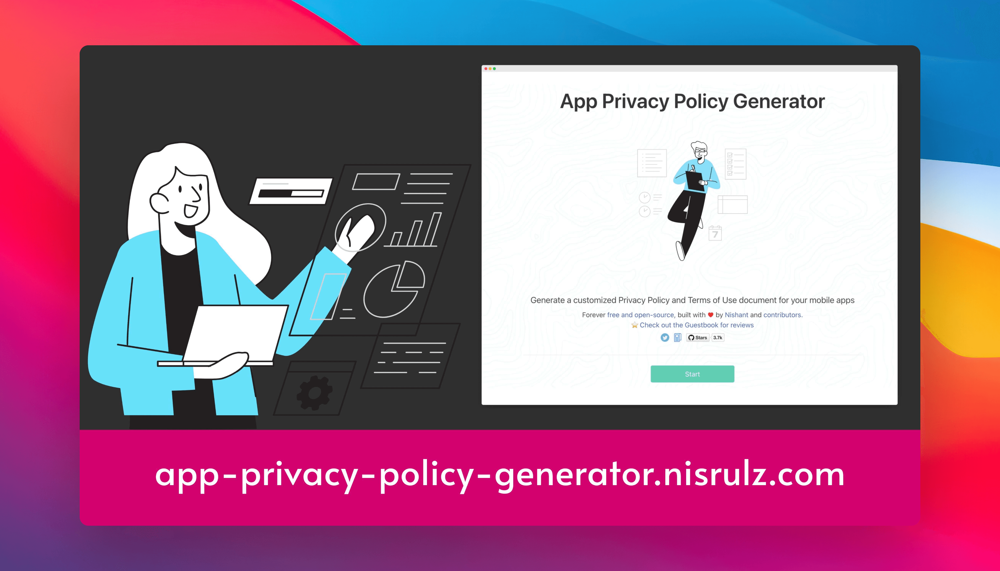
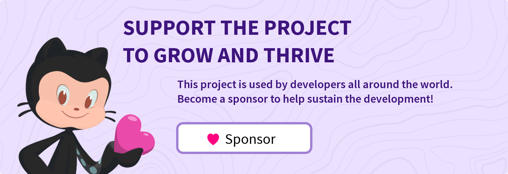

  

<strong>
  <em>A web app that is free, open-source, and perfect for generating a generic or GDPR-compliant privacy policy and terms of use for your mobile apps. 📄✨</em>
</strong> 
<a href="https://app-privacy-policy-generator.nisrulz.com/">Web App</a> | 
<a href="https://app-privacy-policy-generator.nisrulz.com/reviews.html" target="_blank" rel="noopener noreferrer">Guestbook for reviews</a>

 

   

[](https://bsky.app/intent/compose?text=%F0%9F%93%9D%20App%20Privacy%20Policy%20Generator%3A%20A%20free%20web-app%20to%20generate%20a%20generic%20privacy%20policy%20for%20your%20Android%2FiOS%2FKaiOS%20%F0%9F%93%B1%20apps%20%F0%9F%9A%80.%0A%0A%F0%9F%91%A8%F0%9F%8F%BB%E2%80%8D%F0%9F%92%BB%20Built%20by%20%40nisrulz.com%20%0A%0A%E2%9C%85%20Web%20App%3A%20https%3A%2F%2Fapp-privacy-policy-generator.nisrulz.com%20%0A%0A%E2%9C%85%20Checkout%20Reviews%3A%20https%3A%2F%2Fgithub.com%2Fnisrulz%2Fapp-privacy-policy-generator%2Fissues%2F65%20%0A%0A%23appg%20%23free%20%23app%20%23privacy%20%23policy%20%23generator)

## Status Badges

 

## Project Support

- Before contacting me with issues, please visit the [Issue Tracker](https://github.com/nisrulz/app-privacy-policy-generator/issues) and see if issue was already added there. Just in case.
- If you want to report a bug in the project, please use the [Issue Tracker](https://github.com/nisrulz/app-privacy-policy-generator/issues) to [**open an issue**](https://github.com/nisrulz/app-privacy-policy-generator/issues/new/choose).
- If you want to discuss the project with the community, join the [Discussion](https://github.com/nisrulz/app-privacy-policy-generator/discussions).
- If needed, you can also contact me on [Bluesky](https://bsky.app/profile/nisrulz.com).

## Contributing

This project's contributions work a little different than most GitHub projects. If you have a small bug fix or typo fix, please open a Pull Request(PR) directly to this repository.

In order to reduce burnout by limiting the maintenance overhead of reviewing and validating third-party code, this project is open to code contributions for **bug fixes only**. Features carry a long-term maintenance burden so they will not be accepted at this time.

If you would like to contribute a feature, please follow these steps:

1. Check for existing [issues](https://github.com/nisrulz/app-privacy-policy-generator/issues) first, before filing an issue.
2. Discuss the feature in the new/existing issue.
3. Create a pull request from **your fork** to this repository, once details are clear and approved by maintainer.
4. Post a link to your pull request in the issue for consideration.

It's likely that code style and implementation details will need to be tweaked so it's easier to for me to grab your
implementation as a starting point when implementing a feature.

Additionally, make sure to [read the dev docs](dev-doc.md) to

- [Add a new 3rd party service to the web app](https://github.com/nisrulz/app-privacy-policy-generator/blob/master/dev-doc.md#contributing-more-3rd-party-services-links)
- [Add a new template for Privacy Policy or Terms & Conditions](https://github.com/nisrulz/app-privacy-policy-generator/blob/master/dev-doc.md#development)
- [Update the web app for new features/bugfixes](https://github.com/nisrulz/app-privacy-policy-generator/blob/master/dev-doc.md#development)

## Contribute financially

Servers aren't free and running/maintaining this project isn't free either.

Please consider contributing on [GitHub sponsor](https://github.com/sponsors/nisrulz) to offer continued support. You can do a one-time contribution or set up a recurring monthly contribution.

_Alternatively you can fuel my late night programming sessions by [buying me coffee :coffee:](https://ko-fi.com/nisrulz)._

## Support this project

- Tell me you like this project or how it helped you out!
  - **Star** this repository and tell all your friends about it.
  - [Comment in the project's guestbook](https://github.com/nisrulz/app-privacy-policy-generator/issues/65) :blush:
  - Reach out on [Bluesky](https://bsky.app/profile/nisrulz.com)

Thanks for your interest in this project :heart:

## Author & Contributors

This project was created by [Nishant Srivastava](https://github.com/nisrulz/nisrulz.github.io#nishant-srivastava) but hopefully developed and maintained by many others.

See the [the list of contributors here](https://github.com/nisrulz/app-privacy-policy-generator/graphs/contributors).

## Star History

<a href="https://www.star-history.com/#nisrulz/app-privacy-policy-generator&Timeline">
 <picture>
   <source media="(prefers-color-scheme: dark)" srcset="https://api.star-history.com/svg?repos=nisrulz/app-privacy-policy-generator&type=Timeline&theme=dark" />
   <source media="(prefers-color-scheme: light)" srcset="https://api.star-history.com/svg?repos=nisrulz/app-privacy-policy-generator&type=Timeline" />
   
 </picture>
</a>

## License

[AGPLv3 | Copyright 2017 Nishant Srivastava](LICENSE)
