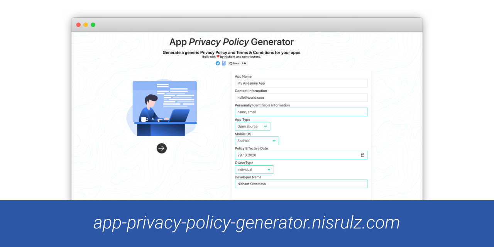
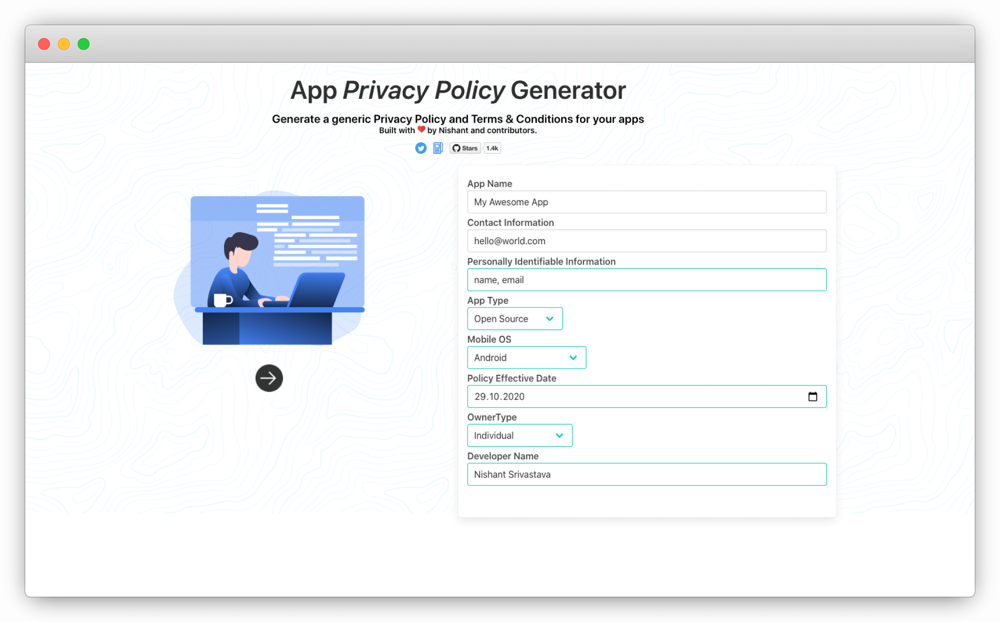
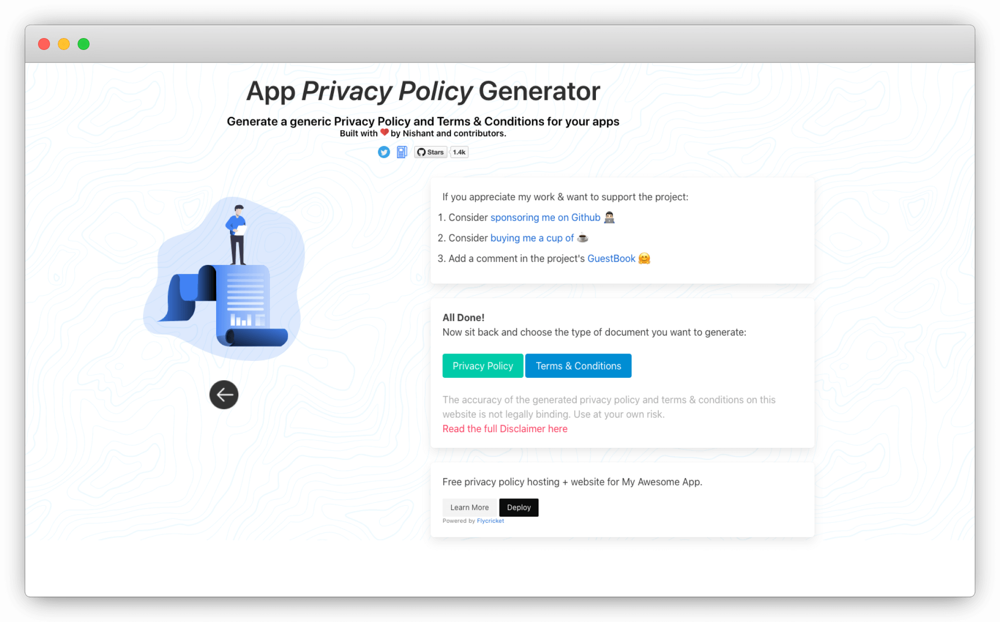

  

<strong>
  <em>A simple web app to generate a generic privacy policy for your Android/iOS apps</em>
</strong> 
<a href="https://app-privacy-policy-generator.nisrulz.com/">Click here to access the webapp online</a>

 

   

## Status Badges

 

## Contribution

[Read the dev docs](dev-doc.md) to

- [Add a new 3rd party service to the web app](https://github.com/nisrulz/app-privacy-policy-generator/blob/master/dev-doc.md#contributing-more-3rd-party-services-links)
- [Add a new template for Privacy Policy or Terms & Conditions](https://github.com/nisrulz/app-privacy-policy-generator/blob/master/dev-doc.md#development)
- [Update the web app for new features/bugfixes](https://github.com/nisrulz/app-privacy-policy-generator/blob/master/dev-doc.md#development)

## Pull Requests

I welcome and encourage all pull requests. It usually will take me within 24-48 hours to respond to any issue or request. Here are some basic rules to follow to ensure timely addition of your request:

1. If its a feature, bugfix, or anything please only change code to what you specify.
2. Please keep PR titles easy to read and descriptive of changes, this will make them easier to merge :)
3. Pull requests _must_ be made against `develop` branch. Any other branch (unless specified by the maintainers) will get rejected.
4. Check for existing [issues](https://github.com/nisrulz/app-privacy-policy-generator/issues) first, before filing an issue.
5. Have fun!

## Author & Contributors

This project was created by [Nishant Srivastava](https://github.com/nisrulz/nisrulz.github.io#nishant-srivastava) but hopefully developed and maintained by many others. See the [the list of contributors here](https://github.com/nisrulz/app-privacy-policy-generator/graphs/contributors).

## Ways You Can Help/Support this project

- **Star** this repository and tell all your friends about it.
- **Watch** for new releases to get an update if something happens.
- [**Open an Issue**](https://github.com/nisrulz/app-privacy-policy-generator/issues/new/choose) if you catch any error in copy text or within the project itself.
- **Open a Pull Request** to include support for adding more 3rd party service's links or fixes against [existing issues](https://github.com/nisrulz/app-privacy-policy-generator/issues).

- If you can spare a few 💵:

  - [Buy me a coffee :coffee:](https://www.buymeacoffee.com/nisrulz) (one-time),
  - or [Sponsor me on GitHub](https://github.com/sponsors/nisrulz) (recurring monthly).

- Tell me you like this project or how it helped you out!

  - [Comment in the project's guestbook](https://github.com/nisrulz/app-privacy-policy-generator/issues/65) :blush:,
  - Reach out on [Twitter](https://twitter.com/nisrulz),
  - or [send a nice email my way](mailto:nisrulz@gmail.com)!

Thanks for your interest in this software :heart:

## Screenshots

## License

Copyright 2017-Present Nishant Srivastava

AGPLv3: https://www.gnu.org/licenses/agpl-3.0.html
