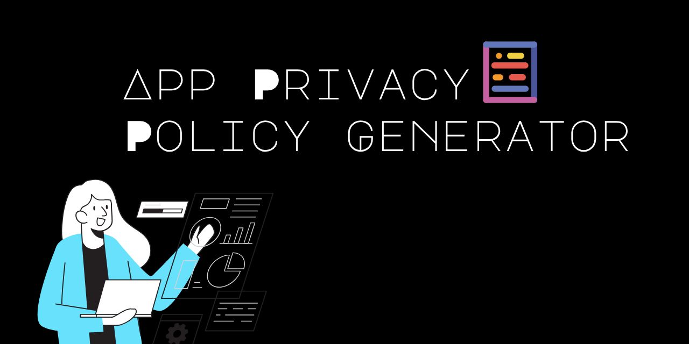
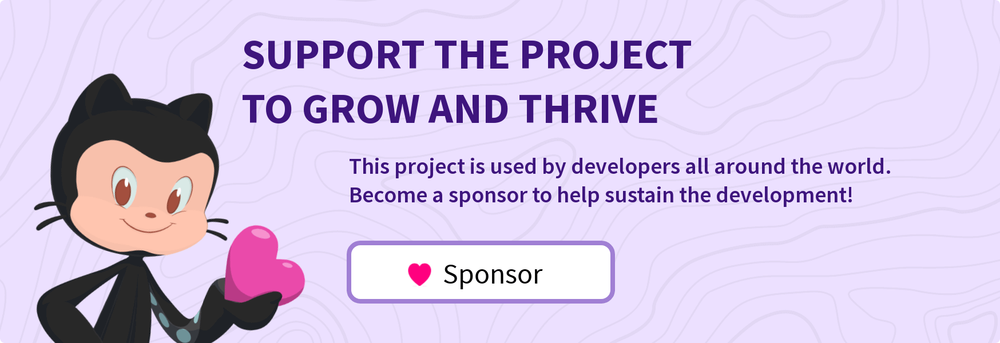

  

<strong>
  <em>A free, open-source web app to generate privacy policies and terms & conditions for your Android, iOS, KaiOS, and Web apps. Supports Simple, No-Tracking, and GDPR-compliant policies with DSA compliance. Installable as a PWA with offline support. 📄✨</em>
</strong> 
<a href="https://app-privacy-policy-generator.nisrulz.com/">Web App</a> |
<a href="https://app-privacy-policy-generator.nisrulz.com/reviews.html" target="_blank" rel="noopener noreferrer">Guestbook for reviews</a>

 

     

[](https://bsky.app/intent/compose?text=%F0%9F%93%9D%20App%20Privacy%20Policy%20Generator%3A%20A%20free%20web-app%20to%20generate%20a%20generic%20privacy%20policy%20for%20your%20Android%2FiOS%2FKaiOS%20%F0%9F%93%B1%20apps%20%F0%9F%9A%80.%0A%0A%F0%9F%91%A8%F0%9F%8F%BB%E2%80%8D%F0%9F%92%BB%20Built%20by%20%40nisrulz.com%20%0A%0A%E2%9C%85%20Web%20App%3A%20https%3A%2F%2Fapp-privacy-policy-generator.nisrulz.com%20%0A%0A%E2%9C%85%20Checkout%20Reviews%3A%20https%3A%2F%2Fgithub.com%2Fnisrulz%2Fapp-privacy-policy-generator%2Fissues%2F65%20%0A%0A%23appg%20%23free%20%23app%20%23privacy%20%23policy%20%23generator)

 

## Features

- **3 Policy Types**: Simple, No-Tracking, and GDPR-compliant privacy policies
- **Terms & Conditions**: Full T&C generation with UGC policy, DSA Compliance section, governing law, open-source license toggle, termination provisions, and limitation of liability
- **Platform-aware**: Text adapts to Mobile App, Web App, or Both throughout both policies and T&C
- **8-step Wizard**: Guided form with validation, inline error highlighting, and conditional fields (plus a final step with support/sponsor options)
- **Configurable**: Age of digital consent, AI disclosure toggle, location tracking, PII fields, business address, EU representative, open-source toggle
- **Third-party Services**: 50+ pre-loaded service entries with privacy/terms links
- **Multiple Outputs**: Preview, HTML, or Markdown
- **PWA-ready**: Installable web app with offline caching via service worker, proper manifest and icons
- **Self-hosted**: All dependencies (Vue.js, bulma, normalize.css, to-markdown) served locally — no CDN tracking
- **FAQ & Disclaimer**: In-app FAQ modal and full legal disclaimer with indemnification clause
- **Accessibility**: ARIA labels, alt text, main landmark, form label associations, zoom support

## Contributing

This project accepts **bug fixes only**. This policy helps keep maintenance sustainable and prevents burnout.

If you have a small bug fix or typo fix, open a pull request directly. For feature proposals, please open an issue first to discuss — features carry a long-term maintenance burden and are generally not accepted, but the discussion helps inform future direction.

Before contributing:

- Read the [dev docs](dev-doc.md) and [AGENTS.md](AGENTS.md) for setup and conventions
- Build with `npm install && npm run build` (edit source under `src/` only)

## Support

- **Report bugs**: [Open an issue](https://github.com/nisrulz/app-privacy-policy-generator/issues/new/choose)
- **Community**: [Discussions](https://github.com/nisrulz/app-privacy-policy-generator/discussions)
- **Guestbook**: [Leave a review](https://github.com/nisrulz/app-privacy-policy-generator/issues/65)

## Contribute

Servers and maintenance aren't free. If this tool helped you, consider:

- **Sponsoring** on [GitHub Sponsors](https://github.com/sponsors/nisrulz) (one-time or monthly)
- **Buying me a coffee** on [ko-fi](https://ko-fi.com/nisrulz)
- **Starring** the repo and sharing it with friends

## Author

Created by [Nishant Srivastava](https://github.com/nisrulz). See [contributors](https://github.com/nisrulz/app-privacy-policy-generator/graphs/contributors).

## Star History

<a href="https://www.star-history.com/#nisrulz/app-privacy-policy-generator&Timeline">
 <picture>
   <source media="(prefers-color-scheme: dark)" srcset="https://api.star-history.com/svg?repos=nisrulz/app-privacy-policy-generator&type=Timeline&theme=dark" />
   <source media="(prefers-color-scheme: light)" srcset="https://api.star-history.com/svg?repos=nisrulz/app-privacy-policy-generator&type=Timeline" />
   
 </picture>
</a>

## License

[AGPLv3 | Copyright 2017 Nishant Srivastava](LICENSE)
