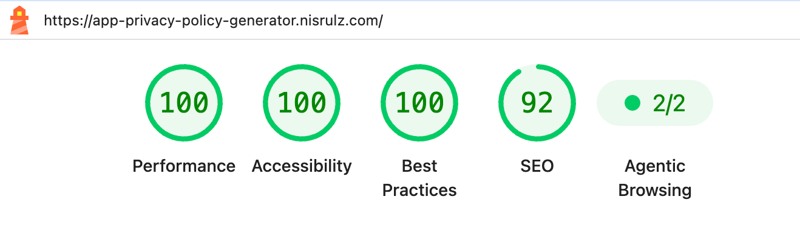

<div align="center">
  
</div>

<div align="center"><strong>
  <em>A free, open-source web app to generate privacy policies and terms & conditions for your Android, iOS, KaiOS, and Web apps.</em>
</strong><br>
<a href="https://app-privacy-policy-generator.nisrulz.com/">Web App</a> /
<a href="https://app-privacy-policy-generator.nisrulz.com/reviews.html" target="_blank" rel="noopener noreferrer">Reviews</a> /
<a href="https://ko-fi.com/A443EQ6" target="_blank" rel="noopener noreferrer">Buy me a Coffee</a>
</div>

<br>

<div align="center">
  <a href="https://mailchi.mp/kotlinweekly/kotlin-weekly-469#:~:text=app%2Dprivacy%2Dpolicy%2Dgenerator"></a><a href="https://github.com/nisrulz/app-privacy-policy-generator">
  
</a> <a href="https://github.com/nisrulz/app-privacy-policy-generator/fork">
  
</a>

[](https://github.com/nisrulz/app-privacy-policy-generator/actions/workflows/firebase-hosting-merge.yml) [](https://github.com/nisrulz/app-privacy-policy-generator/actions/workflows/firebase-hosting-pull-request.yml)



</div>

## What it does

You fill out a wizard, pick what data your app collects, and it spits out a privacy policy and terms & conditions. Three flavors: Simple, No Tracking, GDPR. The text adapts automatically based on whether your app runs on mobile, web, or both. You can tweak age of consent, AI disclosure, location tracking, PII fields, and more. Export as Preview, HTML, or Markdown. It is a PWA too, so it works offline.

## Quick Start

```sh
npm install
make serve
```

Requires [Go](https://go.dev/dl/) 1.25+ and Node.js.

## Docs

| Doc | What's in it |
|-----|-------------|
| [Development](docs/development.md) | Tech stack, build, serve locally, deploy |
| [Localization](docs/localization.md) | Add a new language translation |
| [AGENTS.md](AGENTS.md) | AI agent conventions and project layout |

## Contributing

This project accepts **bug fixes only**. This policy helps keep maintenance sustainable and prevents burnout.

For feature proposals, open an issue first.

```sh
npm install
make serve        # dev server on :8000
make test         # E2E tests (Playwright)
```

## Support

- [Report bugs](https://github.com/nisrulz/app-privacy-policy-generator/issues/new/choose)
- [Discussions](https://github.com/nisrulz/app-privacy-policy-generator/discussions)
- [Leave a review](https://github.com/nisrulz/app-privacy-policy-generator/issues/65)

## Sponsor

Servers and maintenance are not free. If this tool helped you out, consider [sponsoring on GitHub](https://github.com/sponsors/nisrulz), [buying me a coffee](https://ko-fi.com/nisrulz), sharing it, or [leaving a review](https://github.com/nisrulz/app-privacy-policy-generator/issues/65).

[](https://github.com/sponsors/nisrulz)

## Author

[Nishant Srivastava](https://github.com/nisrulz) and [contributors](https://github.com/nisrulz/app-privacy-policy-generator/graphs/contributors).

## Star History

<a href="https://www.star-history.com/#nisrulz/app-privacy-policy-generator&Timeline">
 <picture>
   <source media="(prefers-color-scheme: dark)" srcset="https://api.star-history.com/svg?repos=nisrulz/app-privacy-policy-generator&type=Timeline&theme=dark" />
   <source media="(prefers-color-scheme: light)" srcset="https://api.star-history.com/svg?repos=nisrulz/app-privacy-policy-generator&type=Timeline" />
   
 </picture>
</a>

## License

[AGPLv3](LICENSE)
